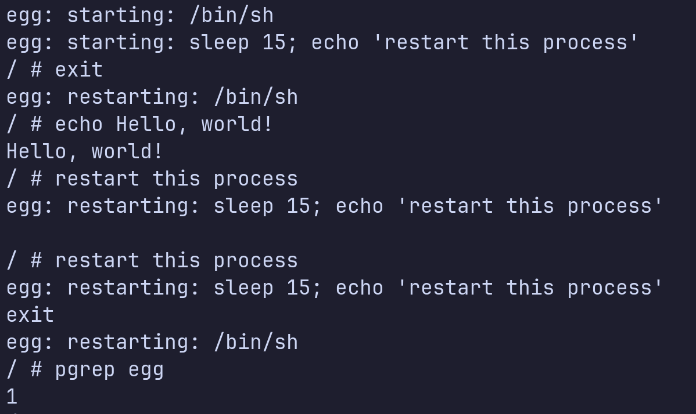

# Egg Init System

Ultrasmall init system written in Cent.



## Building

Make sure you have the dependencies installed:

- Cent
- Make

Clone the repository:

```sh
$ git clone https://github.com/centlang/egg && cd egg
```

Build:

```sh
$ make
```

## Testing with Docker (Alpine)

```sh
$ docker run --rm -it -v $PWD/build/release/egg:/egg alpine:latest /egg
```
